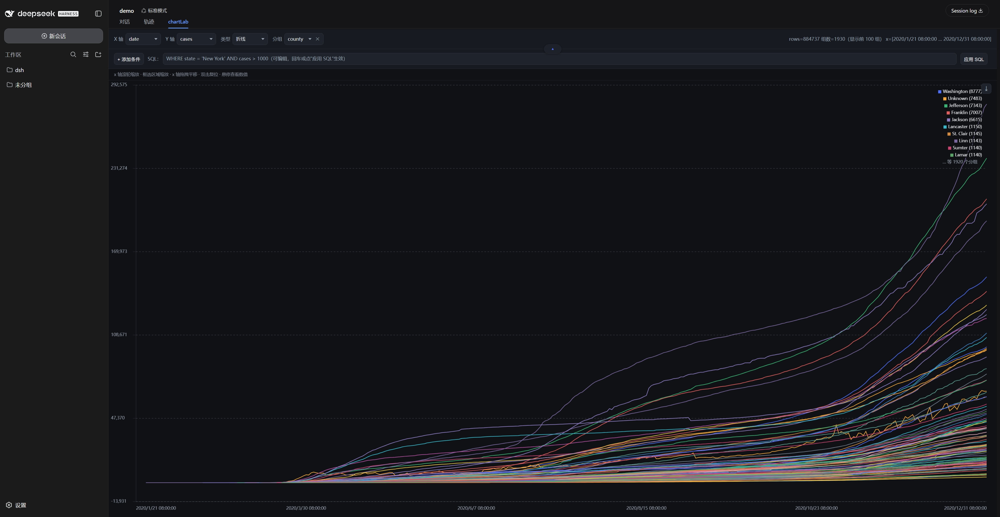

<div align="center">

# 📈 dsh-chartlab

[English](./README_EN.md) | 简体中文

**数据 → 可交互图表实验室 · DeepSeek Harness 插件**

把本地数据文件（`.csv` / `.xlsx` / `.xls`）或 DuckDB 数据库变成可缩放、可筛选、可分组的交互图表

<p align="center">
  <a href="https://github.com/SMOKTEA/dsh-chartlab/stargazers"></a>
  <a href="https://github.com/SMOKTEA/dsh-chartlab/blob/master/LICENSE"></a>
  <a href="https://github.com/SMOKTEA/dsh-chartlab"></a>
  <a href="https://awesome-dsh-plugin.com"></a>
</p>

</div>

---

一句话：**让 Agent 帮你把数据变成一张可交互的图表。**

- **三种数据源** —— 本地数据文件（`.csv` / `.xlsx` / `.xls`）、或 DuckDB 数据库（`.duckdb` / `.ddb`）里的表，说句话就能出图。
- **支持百万行数据** —— 数据留在后台，图表只按当前可视范围取数，百万行数据缩放平移也流畅。
- **完整图表工作台** —— 折线 / 散点；框选缩放、滚轮缩放、拖拽平移、悬浮读数。
- **筛选 · 分组 · SQL** —— 条件筛选、按列分组画多条线，也可以直接写 SQL 查询。
- **原生观感** —— 自动跟随 DSH 的语言（中 / 英）与主题（深 / 浅），切换无需刷新。
- **按会话隔离** —— 每个对话只看自己的图表，删除会话时一并清理。

<p align="center">
  
</p>

---

## ✨ 功能

| 能力 | 说明 |
|---|---|
| 数据源 | 本地数据文件（`.csv` / `.xlsx` / `.xls`）、DuckDB 数据库表（`.duckdb` / `.ddb`）；DuckDB 表名可省略，自动取第一张表 |
| 图表类型 | 折线图、散点图 |
| 交互 | 框选缩放、滚轮缩放、拖拽平移、悬浮读数、截图下载 |
| 筛选 · 分组 | 条件筛选（等于 / 不等于 / 区间 / 多选，支持日期范围）；按某一列分组画多条线 |
| SQL | 在图表里直接写 SQL 查询，支持粘贴多行 SQL |
| 主题与语言 | 跟随 DSH 深 / 浅主题与中 / 英语言 |
| 会话隔离 | 每个对话独立，删除会话自动清理缓存 |

---

## 🚀 快速开始

```powershell
dsh plugin --profile web add dsh-chartlab

```

然后在聊天里直接说：

> **用 dsh-chartlab 插件绘制 `/path/to/your-data.csv` 的图表**
>
> **用 dsh-chartlab 插件绘制 `/path/to/your-data.xlsx` 的图表**
>
> **用 dsh-chartlab 插件绘制 `/path/to/your-data.duckdb` 中 `sales` 表的图表**（表名可省略，自动取第一张表）

---

## 🗺️ Roadmap

| 状态 | 计划 | 说明 |
|---|---|---|
| ✅ 已支持 | CSV / Excel / DuckDB 数据源 | 一句话生成可交互图表 |
| ✅ 已支持 | 筛选、分组多线、SQL 行筛选 | 图表页内直接操作 |
| 🚧 计划中 | SQL 聚合与排序 | GROUP BY / ORDER BY / 聚合函数 |
| 🚧 计划中 | Excel 的 SQL 面板 | 目前 SQL 仅支持 CSV / DuckDB |
| 🚧 计划中 | Excel 流式读取 | 大 xlsx 目前同步全量加载 |
| 🚧 计划中 | Excel 多工作表 | 目前读取第一个工作表 |
| 💡 想法 | 更多数据源 | Parquet / JSON 等 |

欢迎提 issue / PR。

---

## 📄 License

[MIT](LICENSE) © 2026 mok
